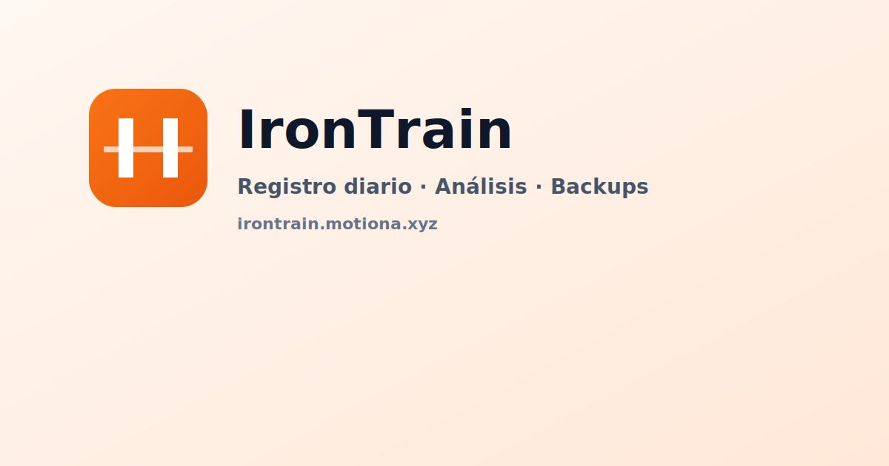
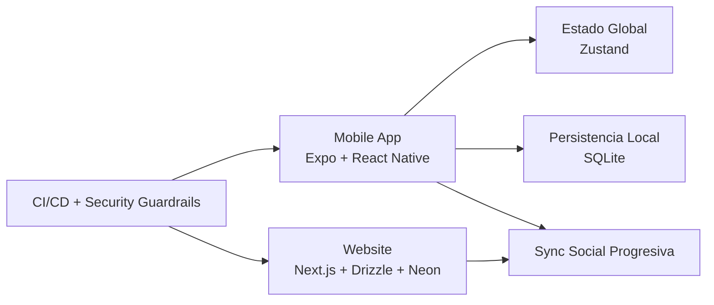

<div align="center">


# IronTrain

### App mobile de entrenamiento de fuerza (local-first) con sincronización social progresiva

[](#)
[](#)
[](#)
[](#)
[](#)

</div>

---

## 🚀 TL;DR

> **Onboarding express:** empezá por **Inicio rápido** y **Flujo de desarrollo**.

- 📱 **Producto principal:** app mobile con Expo + React Native.
- 💾 **Core técnico:** persistencia **local-first** con SQLite (`expo-sqlite`).
- 🌐 **Web desacoplada:** `website/` con Next.js + Drizzle + Neon/Postgres.
- 🧠 **Estado/Navegación:** Zustand + Expo Router.
- 🛡️ **Calidad obligatoria:** tests, typecheck y checks de CI/Security antes de merge.

---

## 🎬 Vista rápida

<div align="center">
  
</div>

---

## 🧱 Arquitectura (alto nivel)



| Capa | Stack | Propósito |
| :-- | :-- | :-- |
| Mobile (raíz) | React Native 0.81, React 19, Expo SDK 54, Expo Router, Zustand | App principal y UX de entrenamiento |
| Persistencia | `expo-sqlite` | Operación local-first/offline resiliente |
| Website (`/website`) | Next.js 15, React 19, Drizzle ORM, Neon/Postgres | Superficie web desacoplada |
| Testing | Jest (mobile), Vitest (website) | Validación funcional y técnica |

> **Guardrails de operación:** los workflows de CI, seguridad y release Android son obligatorios para calidad y seguridad.

---

## 🗂️ Estructura del repositorio

```text
app/                   # Rutas y pantallas Expo Router
components/            # UI reutilizable y widgets
src/                   # Servicios, estado, hooks, dominio
docs/                  # Documentación operativa y técnica
website/               # App web desacoplada
.github/workflows/     # CI, Security, Release Android
```

---

## ⚡ Inicio rápido

### Prerrequisitos

- Node **22.x** (recomendado)
- `npm`
- Tooling de Expo para desarrollo mobile local

### 📱 Mobile (root)

```bash
# 1) Instalar dependencias
npm install

# 2) Validaciones locales
npm test -- --watch=false
npx tsc --noEmit

# 3) Levantar entorno de desarrollo
npm start

# Plataformas
npm run android
npm run ios
npm run web
```

### 💻 Website

```bash
cd website

# 1) Instalar dependencias
npm install

# 2) Desarrollo
npm run dev

# 3) Build producción
npm run build
```

---

## 🔄 Flujo recomendado de desarrollo

1. Crear rama pequeña y con alcance claro.
2. Implementar cambio focalizado.
3. Ejecutar validaciones locales (tests + typecheck, y build web si aplica).
4. Abrir PR con contexto de riesgo + evidencia de validación.
5. Mergear solo con checks requeridos en verde.

---

## 🛡️ CI/CD y seguridad

- CI principal: `.github/workflows/ci.yml`
- Seguridad continua: `.github/workflows/security.yml`
- Release Android: `.github/workflows/release-android.yml`
- Guardrails clave: permisos mínimos, checks requeridos, dependency review y escaneo de dependencias

---

## 📦 Release Android (resumen)

1. Preparar changelog y versión.
2. Crear tag semver: `vMAJOR.MINOR.PATCH`.
3. Ejecutar pipeline `release-android.yml` para build/publicación de artefactos.
4. Verificar checksum y notas de release.

---

<details>
<summary><strong>🧯 Troubleshooting rápido</strong></summary>

- Si falla instalación en CI: validar versión de Node + lockfile.
- Si falla typecheck: corregir primero el error raíz.
- Si falla build web: reproducir localmente dentro de `website/`.
- Si falla release Android: revisar tag semver y secretos.
- Si hay inconsistencias de sync social/rutinas compartidas: revisar estado local/remoto y conflictos de revisión.

</details>

---

## 📚 Documentación operativa

- Arquitectura: [`docs/ARCHITECTURE.md`](docs/ARCHITECTURE.md)
- Desarrollo: [`docs/DEVELOPMENT.md`](docs/DEVELOPMENT.md)
- Base de datos: [`docs/DATABASE.md`](docs/DATABASE.md)
- CI/CD: [`docs/CI_CD.md`](docs/CI_CD.md)
- Guardrails DevOps: [`docs/DEVOPS_GUARDRAILS.md`](docs/DEVOPS_GUARDRAILS.md)
- Testing: [`docs/TESTING.md`](docs/TESTING.md)
- Release: [`docs/RELEASE.md`](docs/RELEASE.md)
- Distribución: [`docs/DISTRIBUTION.md`](docs/DISTRIBUTION.md)
- Runbook operacional: [`docs/RUNBOOK.md`](docs/RUNBOOK.md)
- Comandos operativos: [`docs/OPERATIONS_COMMANDS.md`](docs/OPERATIONS_COMMANDS.md)
- Troubleshooting: [`docs/TROUBLESHOOTING.md`](docs/TROUBLESHOOTING.md)
- Seguridad y privacidad: [`docs/SECURITY_PRIVACY.md`](docs/SECURITY_PRIVACY.md)

---

## ✅ Criterio de calidad para cambios

- Sin checks críticos fallando en PR.
- Sin cambios de alto riesgo sin documentación o mitigación.
- Documentación técnica actualizada cuando cambian arquitectura, operación o seguridad.
